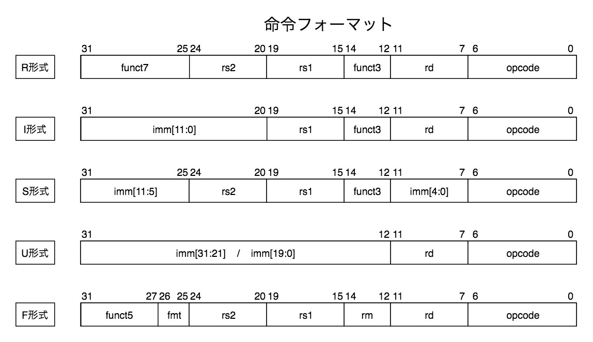
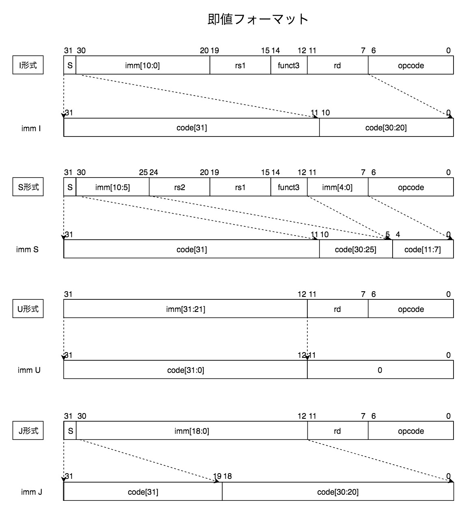

# CPU実験レポート

## ISAおよびマイクロアーキテクチャ(担当コア係五反田)
### 主な特徴
- ワードサイズ:	32bit
- ワード単位アドレッシング
	- 結果、シーケンシャルな命令実行時、PCの増加は4ではなく1
- ハーバードアーキテクチャ
	- 命令メモリ:	(2^14Word)	0x0000 ~ 0x3FFF
	- データメモリ:	(2^18Word)	0x00000 ~ 0x3FFFF
- UART BaudRate:	115200

### 命令および即値のフォーマット
RISC-Vの命令形式を元に5つの命令フォーマット(R,I,S,U,F)を策定した。
そのうち、3形式(I,S,U)は即値を持ち、U形式はさらに即値の形式として、U形式およびJ形式の2形式に分類される。  

  

### レジスタ
- プログラムカウンタ:	pc
- 汎用レジスタ: 32個	(x0~x31)
	- x0は0で固定される。
	- x0への書き込みは棄却される。
- 浮動小数点レジスタ:32個	(f0~f31)
	- f0およびf11~f29は以下に示す値に固定。
	- x0と同様f0,f11~f29への書き込みは棄却される。

| レジスタ名 | 値        | bit表現      | 備考              |
|:------|:---------|:-----------|:----------------|
| f0    | 0.0      | 0x00000000 |                 |
| f11   | 1.0      | 0x3F800000 | //LUIで生成可能      |
| f12   | 2.0      | 0x40000000 | //LUIで生成可能      |
| f13   | 4.0      | 0x40800000 | //LUIで生成可能      |
| f14   | 10.0     | 0x41200000 | //LUIで生成可能      |
| f15   | 15.0     | 0x41700000 | //LUIで生成可能      |
| f16   | 20.0     | 0x41A00000 | //LUIで生成可能      |
| f17   | 128.0    | 0x43000000 | //LUIで生成可能      |
| f18   | 200.0    | 0x43480000 | //LUIで生成可能      |
| f19   | 255.0    | 0x437F0000 | //LUIで生成可能      |
| f20   | 850.0    | 0x44548000 | //LUIで生成可能      |
| f21   | 0.100    | 0x3DCCCCCD | //LUI&ADDIで生成可能 |
| f22   | 0.200    | 0x3E4CCCCD | //LUI&ADDIで生成可能 |
| f23   | 0.001    | 0x3A83126F | //LUI&ADDIで生成可能 |
| f24   | 0.005    | 0x3BA3D70A | //LUI&ADDIで生成可能 |
| f25   | 0.150    | 0x3E19999A | //LUI&ADDIで生成可能 |
| f26   | 0.250    | 0x3E800000 | //LUIで生成可能      |
| f27   | 0.500    | 0x3F000000 | //LUIで生成可能      |
| f28   | pi       | 0x40490FDB | //LUI&ADDIで生成可能 |
| f29   | 30.0 /pi | 0x4118C9EB | //LUI&ADDIで生成可能 |

### 基本命令(RV32I改)

| 命令    |  opcode   | 形式                           | 解釈疑似コード                                 | 命令(即値)フォーマット |
|:------|:---------:|:-----------------------------|:----------------------------------------|:------------:|
| lui   | 0b0110111 | _lui rd, imm_                | rd = imm << 12,pc++                     |      U       |
| auipc | 0b0010111 | _auipc rd, imm_              | rd = pc + (imm<<12),pc++                |      U       |
| jal   | 0b1101111 | _jal rd, imm_                | rd = pc + 1  ,pc += imm                 |      J       |
| jalr  | 0b1100111 | _jalr rd, rs1, imm_          | rd = pc + 1  ,pc = rs1 + imm            |      I       |
| beq   | 0b1100011 | _beq rs1, rs2, pc + imm<<2_  | if(rs1 == rs2)then pc += imm else pc++  |      B       |
| bne   |    同上     | _bne rs1, rs2, pc + imm<<2_  | if(rs1 != rs2)then pc += imm else pc++  |      B       |
| blt   |    同上     | _blt rs1, rs2, pc + imm<<2_  | if(rs1 < rs2) then pc += imm else pc++  |      B       |
| bge   |    同上     | _bge rs1, rs2, pc + imm<<2_  | if(rs1 >= rs2)then pc += imm else pc++  |      B       |
| bltu  |    同上     | _bltu rs1, rs2, pc + imm<<2_ | if(rs1 < rs2) then pc += imm else  pc++ |      B       |
| bgeu  |    同上     | _bgeu rs1, rs2, pc + imm<<2_ | if(rs1 >= rs2)then pc += imm else pc++  |      B       |
| lw    | 0b0000011 | _lw rd, imm(rs1)_            | rd = mem[rs1+imm] ,pc++                 |      I       |
| sw    | 0b0100011 | _sw rs2, imm(rs1)_           | mem[addr] = rs2 ,pc++                   |      S       |
| addi  | 0b0010011 | _addi rd, rs1, imm_          | rd = rs1 + imm ,pc++                    |      I       |
| slti  |    同上     | _slti rd, rs1, imm_          | rd = (rs1 < imm) ? 1 : 0 ,pc++          |      I       |
| sltiu |    同上     | _sltiu rd, rs1, imm_         | rd = (rs1 < imm) ? 1 : 0 ,pc++          |      I       |
| xori  |    同上     | _xori rd, rs1, imm_          | rd = rs1 ^ imm ,pc++                    |      I       |
| ori   |    同上     | _ori rd, rs1, imm_           | rd = rs1 ｜imm ,pc++                     |      I       |
| andi  |    同上     | _andi rd, rs1, imm_          | rd = rs1 & imm ,pc++                    |      I       |
| slli  |    同上     | _slli rd, rs1, imm_          | rd = rs1 << imm ,pc++                   |   I(5bit)    |
| srli  |    同上     | _srli rd, rs1, imm_          | rd = rs1 >> imm ,pc++                   |   I(5bit)    |
| srai  |    同上     | _srai rd, rs1, imm_          | rd = rs1 >>> imm ,pc++                  |   I(5bit)    |
| add   | 0b0110011 | _add rd, rs1, rs2_           | rd = rs1 + rs2 ,pc++                    |      R       |
| sub   |    同上     | _sub rd, rs1, rs2_           | rd = rs1 - rs2 ,pc++                    |      R       |
| sll   |    同上     | _sll rd, rs1, rs2_           | rd = rs1 << rs2 ,pc++                   |      R       |
| slt   |    同上     | _slt rd, rs1, rs2_           | rd = (rs1 < rs2) ? 1:0 ,pc++            |      R       |
| sltu  |    同上     | _sltu rd, rs1, rs2_          | rd = (rs1 < rs2) ? 1:0 ,pc++            |      R       |
| xor   |    同上     | _xor rd, rs1, rs2_           | rd = rs1 ^ rs2 ,pc++                    |      R       |
| srl   |    同上     | _srl rd, rs1, rs2_           | rd = rs1 >> rs2 ,pc++                   |      R       |
| sra   |    同上     | _sra rd, rs1, rs2_           | rd = rs1 >>> rs2 ,pc++                  |      R       |
| or    |    同上     | _or rd, rs1, rs2_            | rd = rs1 ｜rs2 ,pc++                     |      R       |
| and   |    同上     | _and rd, rs1, rs2_           | rd = rs1 & rs2 ,pc++                    |      R       |

### 不動小数点命令(RV32F改)

|  命令   |  opcode   |         形式          |        解釈疑似コード        | 命令フォーマット |      レジスタ規定      |    備考     |
|:-----:|:---------:|:-------------------:|:---------------------:|:--------:|:----------------:|:---------:|
|  flw  | 0b0000111 | _flw rd, imm(rs1)_  |  rd = mem\[rs1+imm\]  |    I     |   rd:fn,rs1:xn   |           |
|  fsw  | 0b0100111 | _fsw rs2, imm(rs1)_ | mem\[rs1+imm\] = rs2  |    S     |  rs2:fn,rs1:xn   |           |
| fadd  | 0b1010011 | _fadd rd, rs1, rs2_ |    rd = rs1 +. rs2    |    F     |  rd,rs1,rs2:fn   |  IPコア実装   |
| fsub  |    同上     | _fsub rd, rs1, rs2_ |    rd = rs1 -. rs2    |    F     |  rd,rs1,rs2:fn   |  IPコア実装   |
| fmul  |    同上     | _fmul rd, rs1, rs2_ |    rd = rs1 *. rs2    |    F     |  rd,rs1,rs2:fn   |  IPコア実装   |
| fdiv  |    同上     | _fdiv rd, rs1, rs2_ |    rd = rs1 /. rs2    |    F     |  rd,rs1,rs2:fn   |  IPコア実装   |
| fsqrt |    同上     |   _fsqrt rd, rs1_   |    rd = sqrtf(rs)     |    F     |     rd,rs:fn     |  IPコア実装   |
| fabs  |    同上     |   _fabs rd, rs1_    |    rd = fabsf(rs)     |    F     |     rd,rs:fn     | verilog実装 |
| fneg  |    同上     |   _fneg rd, rs1_    |       rd = -rs        |    F     |     rd,rs:fn     | verilog実装 |
|  feq  |    同上     | _feq rd, rs1, rs2_  |     rd = rs1==rs2     |    F     | rd:xn,rs1,rs2:fn | verilog実装 |
|  flt  |    同上     | _flt rd, rs1, rs2_  |     rd = rs1<rs2      |    F     | rd:xn,rs1,rs2:fn |  IPコア実装   |
|  fle  |    同上     | _fle rd, rs1, rs2_  |     rd = rs1<=rs2     |    F     | rd:xn,rs1,rs2:fn |  IPコア実装   |
| itof  |    同上     |   _itof rd, rs1_    |    rd = (float)rs1    |    F     |   rd:fn,rs1:xn   |  IPコア実装   |
| ftoi  |    同上     |   _ftoi rd, rs1_    |   rd = roundf(rs2)    |    F     |   rd:xn,rs1:fn   |  IPコア実装   |
| floor |    同上     |   _floor rd, rs1_   | rd = (int)floorf(rs1) |    F     |   rd:xn,rs1:fn   | verilog実装 |
| xtof  |    同上     |  _xtof rd, rs1_  |   rd = rs1(bitコピー)    |    F     |   rd:fn,rs1:xn   |           |
| ftox  |    同上     |  _ftox rd, rs1_  |   rd = rs1(bitコピー)    |    F     |   rd:xn,rs1:fn   |           |

### IO拡張命令

### ob
- オペコード:0b0101011
- funct3: 0b000 (sbと同じ)
- 命令形式: _ob rs2_

output byteの略。例えば _ob x1_ とするとx1レジスタの下位8bitを出力

### ib
- オペコード:0b0001011
- funct3: 0b100 (lbuと同じ)
- 命令形式: _ib rd_

input byteの略。例えば _ib x1_ とすると8bitの入力を上位24bitゼロ拡張してx1に入れる。

## シミュレータについて(担当シミュレータ係毛利)
-１分半ほどで実行が終了する  
-シミュレーターの使い方  

COMAND_LINE_OPTION
（void parse_commandline_arg(int argc, char **argv);がコピペなので使い方はsim_coreと同様）

	-s ソースファイル名:	    アセンブリファイルを指定
	-o 出力ファイル名:		出力ファイル名 指定しないとsim.outに出力
	-i 入力ファイル名:		入力ファイル名 sldを指定する。
	-l ログファイル名:		ログファイル名 指定しないとstderrに出力
	権限次第で書き込めないかも？らしい

COMMAND
-	r or run  
		プログラムの全実行
-	p or print  (未完成)  
		対象に指定した物の値を表示する  
		対象 ::= pc | x0~x31 | f0~f31 |すべて表示all|メモリ（int型float型は別）  
	        (pc(pcxも可)は16進数で表示。10進数で表示したいならpcd）  
-	l or log　　  
		log n0 n1 (n0 n1はint型)と書くと現在の命令から数えてn0番目からn1番目までの命令とその時のレジスタの中身を"simulator.log"に書き出しながら全実行。
-	o or opcode_next（未完成）  　　  
		指定した次のニーモニックまで実行。
-	n or next　　  
		next n　(nはint型)と打つと命令をn個実行
-	c or continue(未完成)　　  
		continue n　(nはint型)と打つと最初から数えてn番目の命令まで実行
-	h or help　　  
		この文章を表示する
-	i or initialize　　  
		初期化
-	q or quit　　  
		シミュレータの終了

## 自分が担当した仕事について

## さらなる高速化に必要なプロセッサ・コンパイラの最適化と、それについて の定量的な評価ほか

